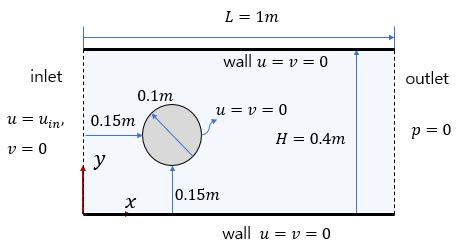

# Flow of Incompressible Fluid  

Viscosity of fluid : $\mu = 0.02kg \cdot (m \cdot sec)^{-1}$
Densitoy if fluid : $\rho = 1kg \cdot m^{3}$  

$
\large
\begin{equation}
\begin{aligned}
u(0,y) &= u_{in}= y(H-y) \frac{4}{H^2} \\
v(0,y) &= 0
\tag{1}
\end{aligned}
\end{equation}
$

* No slip Condition
* Pressure of outlet equals to zero
$
\large
\begin{equation}
\begin{aligned}
& p(1,y) = 0 \\
& u(x,y) = v(x,y) = 0 \ \ @\ wall\ and\ cylinder\ surface
\tag{2}
\end{aligned}
\end{equation}
$
* Continuity Equation
$
\large
\nabla\ \cdot\ \mathbf{V} = 0 \ (incompressible\  flow)
\tag{3}
$

* Navier-Stokes Equation
$
\large
\rho(\mathbf{V} \cdot \nabla)\mathbf{V} = -\nabla p + \mu \nabla^2 \mathbf{V}
\tag{4}
$
Or, Cauchy momentum equation
$
\large
\rho(\mathbf{V} \cdot \nabla)\mathbf{V} = \nabla \cdot \sigma \tag{5}
$
When,
$
\large
\sigma = -p \bar{\mathbf{I}} + \mu ( \nabla \mathbf{V}+(\nabla \mathbf{V})^T ) \tag{6}
$